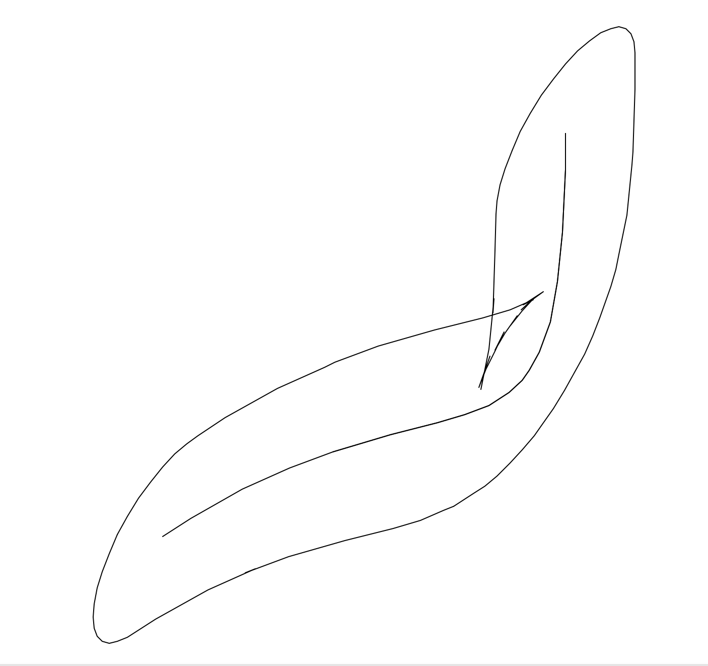

# convex-convolution
Python code for stroking a convex polygon along a polyline.

This is an implementation of the same algorithm as https://observablehq.com/@theohonohan/minkowski-sum-of-polygons-an-elliptical-pen-on-a-bezier-curv. What's missing is code to clean up the cusps—in the JS version, this is handled by libtess2. In Python, the GLU Tesselator is available via OpenGL and Kivy.

Info on using the tesselator from the OpenGL library:
https://github.com/mcfletch/openglcontext/blob/master/OpenGLContext/scenegraph/polygontessellator.py

Info on the Kivy option, which may not be fully supported:
https://kivy.org/doc/stable/api-kivy.graphics.tesselator.html

